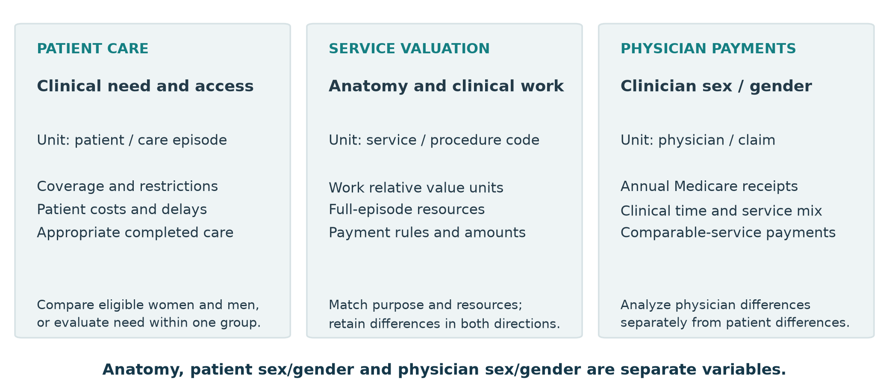
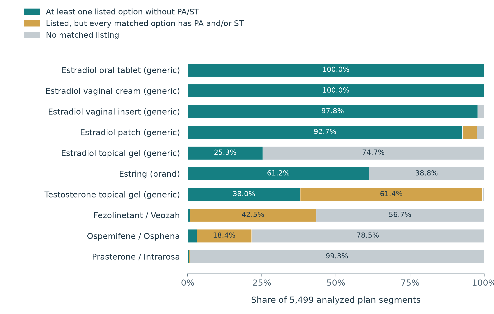
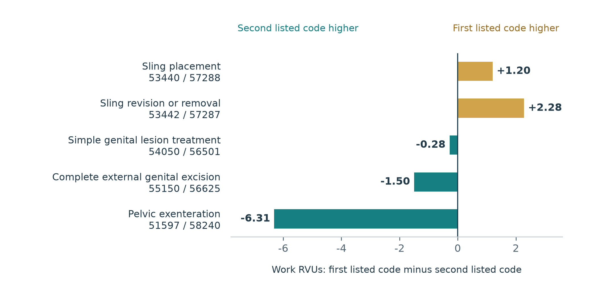
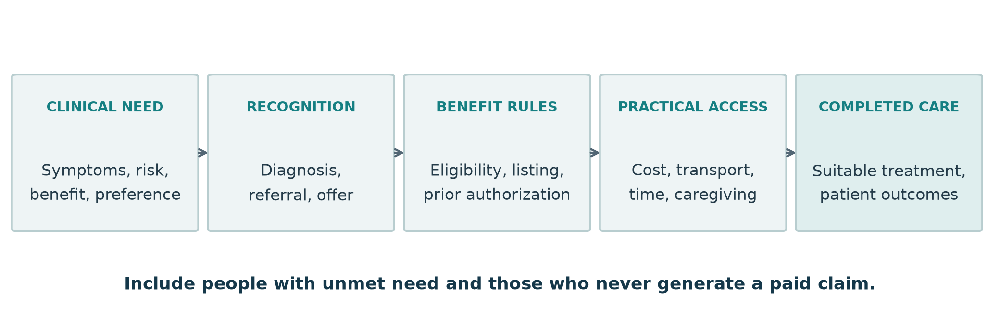

MEDICARE RESEARCH / WHITE PAPER / VERSION 1.0

# Sex, gender and equity in Medicare reimbursement

Preliminary evidence synthesis and research agenda

Coverage, service valuation and access to care for women and men

September 16, 2026

The central question

Do Medicare benefit rules, payment values and practical barriers align with the clinical needs of women and men? This paper identifies signals worth testing, including possible disadvantages affecting either sex, while distinguishing patient access from physician payments.

Abstract

The selected evidence suggests that reimbursement inequity is a question about clinical indication, benefit design, service valuation and completed care. It does not establish a uniform disadvantage to one sex. The formulary snapshot and basic Part D exclusion rules contradict the broad premise that Medicare excludes estradiol while routinely covering Viagra for erectile dysfunction. Procedure studies report differing results, and shared conditions such as osteoporosis reveal possible gaps affecting men. Physician payment studies address a separate question.

This paper brings together 34 retained literature records and 40 selected care-item/indication rows, describes two reproducible CMS data summaries, and proposes eight exploratory hypotheses. The Lancet review by Mauvais-Jarvis and colleagues provides the organizing clinical framework. [L-B01; L-B01-E1]

Review status: Preliminary narrative synthesis. Comprehensive searching, final eligibility adjudication, full-text extraction, formal risk-of-bias appraisal and outcome-specific certainty assessment remain unfinished. No meta-analysis or causal effect estimate is presented.

Prepared from the Medicare research repository: [github.com/clinical-trials/medicare](https://github.com/clinical-trials/medicare). No institutional affiliation or external endorsement is asserted.

## What the evidence currently supports

The working thesis is that inequity can arise when policy and practical access fail to meet clinical need. A difference in spending or use is a signal for investigation; its cause and clinical significance require separate evidence.

1. Formulation and indication matter

Generic oral estradiol and vaginal cream had a listed option without prior authorization or step therapy in all 5,499 analyzed plan segments. Other formulations varied. Basic Part D excludes drugs when used for sexual or erectile dysfunction; other eligible indications and supplemental benefits must be assessed separately. [P-002; P-003; P-026]

2. Procedure comparisons are sensitive to the match

One study reports lower female-anatomy work RVUs in 41 of 55 pairs, while a smaller, closely matched study finds no statistically significant overall difference. Our five-pair 2026 illustration contains differences in both directions. [L-P01; L-P02; P-035; P-036]

3. Sex-specific care can be assessed on its own merits

A benefit change can be evaluated against desired, clinically indicated care within one population. An opposite-sex counterpart is not required. Observational contraceptive coverage evidence provides one starting point. [L-G09]

4. Shared-condition gaps may disadvantage men

Historical bone-density testing was much lower in men. A selected male fracture cohort benefited from outreach, although the trial did not compare men with women. Current eligibility includes several qualifying routes. [L-G04; L-G05; P-012]

5. Physician payments are a distinct evidence stream

Selected studies report lower annual Medicare payments to women physicians. Service volume, referrals, clinical time, specialty and billing circumstances require investigation; some per-service comparisons are null. [L-C01; L-C02; L-C03]

6. Coverage alone is an incomplete access measure

Financial, transport and caregiving barriers may affect treatment completion. Interviews and clinical frameworks suggest mechanisms, but do not quantify Medicare-specific causal effects. [L-Q01; L-B01]

## Scope, sources and methods

Medicare as a national policy benchmark

Medicare is a useful benchmark for care in later life, when per-person use and spending are substantial. In 2020, adults aged 65 and older were 17% of the population and accounted for 37% of all-payer personal health care spending. This does not mean that Medicare finances most US care or that most lifetime care occurs after age 65. Younger beneficiaries remain in scope. [P-041; P-043]

Population and dated scope amendment

At the investigator's direction, the scope was amended on September 16, 2026 to focus on cisgender women and men and exclude transgender-focused patient studies and gender-affirming-care indications. The amendment followed initial searching. Male/female reporting does not establish gender identity: such cohorts remain candidates pending eligibility adjudication. Mixed-population results are eligible only when the in-scope results can be separated. Policy and code data contain no patient identity.

Current synthesis

We organized the selected register by clinical indication, anatomy/physiology, analytic subject, payer and policy period. We retained conflicting and null findings and separated official rules from empirical evidence about their effects. This is a structured narrative synthesis of an assembled evidence set, not an exhaustive review of all Medicare procedures or prescriptions.

Register component | Current extent and interpretation
Care inventory | 40 selected care-item/indication rows; neither a census nor a representative sample.
Active literature | 34 records: 27 primary candidates or retained code-policy components and 7 contextual records.
Analytic subjects | 18 patient care/access; 10 service/anatomy valuation; 3 physician sex/gender; 3 general clinical background.
Audit trail | 8 excluded studies and 1 linked correction retained separately. Two methodology references are separate from the 34 literature records.

PMIDs, DOIs, source links, access levels and stable reference IDs are preserved. Verified metadata does not imply full-text review or final inclusion. Some findings are available only through abstracts or accessible excerpts. No formal GRADE ratings have been assigned. [M-001; M-002]

## Separate the clinical and payment questions

Figure 1. Three analytical streams. Proposed classification framework, not a measured causal model. The patient, service and physician units must remain separate. Clinical framing draws on the Lancet review and its correction. [L-B01; L-B01-E1]

Anatomy and physiology describe the care being delivered. They do not establish a person's gender identity or the gender of the clinician. Record the original study's sex/gender terminology and measurement method.

Clinical basis | Examples and comparison approach
Shared body systems/functions | Bone, breast, lymphatic, cardiovascular and pelvic-floor care. Compare need within the same indication; sex-defined eligibility or unequal disease burden does not make the anatomy exclusive.
Female reproductive anatomy | Local vaginal or cervical care. Assess clinical need, benefits, alternatives and the policy rationale.
Male reproductive anatomy | Prostate or penile care. Use the same need-based assessment; do not assume an interchangeable female counterpart.
Reproductive physiology | Menopause and male hypogonadism are distinct indications. Hormone names alone do not define clinical equivalence.
Mixed/site-dependent services | Split bundled procedures or services by site, indication and code before comparison.

Clinical need must be defined independently of coverage eligibility. Otherwise people excluded by a rule disappear from the denominator, concealing possible unmet need.

## Drug coverage varies within clinical care

Figure 2. Formulary states for ten selected formulations, August 2026. Each bar contains 5,499 unsuppressed plan segments, equally weighted, using 328 formularies. PA = prior authorization; ST = step therapy. States are mutually exclusive within each row. Small segments are unlabeled; exact counts appear in the appendix. Sources: CMS monthly file and reference file. [P-002; P-034; P-037; P-038]

The national snapshot does not support a blanket estradiol exclusion. Oral, vaginal and transdermal products still differ in indication, dose, suitability and restrictions. Testosterone gel is shown as another clinical context, not an equivalent treatment comparator.

Basic Part D excludes a drug when used for sexual or erectile dysfunction. A product used for another eligible indication, such as sildenafil for pulmonary arterial hypertension, requires a separate coverage assessment. Brand-versus-generic naming does not establish inequity. [P-003; P-026]

Clinical evidence is mixed: one vaginal estradiol trial found no primary symptom advantage over dual placebo; a broader review found possible benefits for selected symptoms, generally with low certainty. These findings do not settle every formulation or indication. [L-D03; L-D04]

Inference limit: Listed means at least one matched product/strength. These data contain no beneficiary enrollment weights, clinical need, actual costs, denials or treatment outcomes. PA/ST flags do not disclose the criteria. Nonlisting does not rule out a successful exception. [P-033]

## Procedure valuation: signals in both directions

Figure 3. Five selected procedure pairs, July 2026. Bars show national, unadjusted work relative value units (RVUs): first listed code minus second. Published anatomical/indication comparisons are illustrative, not random or a pooled sex effect. The urologic exenteration code 51597 is not exclusive to male patients. [P-035; P-036; P-045]

Study | Observed result | What it can establish
Penn, 2025 [L-P01] | 41/55 female-anatomy codes had lower work RVUs; male codes averaged 30% higher. | A selected-pair valuation signal; incomplete full-text extraction.
Hathaway, 2024 [L-P02] | 7/10 female procedures had higher work RVUs; no significant overall difference. | Sensitivity to clinical matching; a small null result is not equivalence.
Polan, 2021 [L-P03] | Female procedures: 10.6 vs 9.7 RVUs/hour, but $555 vs $599 modeled compensation/hour. | Different measures can give different directions; dollars use specialty compensation assumptions.

Work RVUs are not dollars paid. Complete comparisons need independently measured preoperative, intraoperative and postoperative work, intensity and risk. Matching global periods alone is insufficient. For the genital-lesion pair, compare like treatment methods; the male code specifies chemical treatment. [P-035; P-036]

Breast reconstruction adds a within-condition question: flap procedures may have lower work RVUs per operative hour than implant procedures. This is a complexity/valuation question, not a patient-sex or physician-gender estimate. [L-P07]

## From benefit rules to completed care

Figure 4. Proposed care-pathway measurement framework. Arrows organize measurements; they do not represent estimated causal effects. Clinical need is assessed independently of reimbursement eligibility. Practical barriers are hypotheses to test. [L-B01; L-Q01]

Shared-condition care can reveal gaps affecting men

In historical Medicare data from 1999-2005, 30.0% of women and 4.4% of men in the analyzed white/Black populations received central dual-energy X-ray absorptiometry (DXA) at least once. These are utilization findings, not need-adjusted estimates of discrimination. In a later trial of selected men after fragility fracture, outreach increased testing from 4.9% to 10.7% and treatment initiation from 2.5% to 4.0%. That trial had no female comparison. [L-G04; L-G05]

A policy change can be studied within one population

Among younger women with disabilities, gaining dual Medicare-Medicaid coverage was associated with a 3.9-percentage-point increase in contraceptive use (95% CI, 3.5-4.3). This observational result motivates study of desired, appropriate contraception; more utilization is not automatically better care. [L-G09]

Historical burden must be interpreted against current policy

A breast-cancer study reported greater monthly out-of-pocket spending with lymphedema. Insurer-policy research also describes coverage gaps. Both predate Medicare's compression-treatment benefit, which began in 2024. A current evaluation should test unmet need and costs after the change; compression items, pumps and surgery are distinct benefits. [L-A01; L-A02; P-021; P-022]

Kidney-care interviews with 51 nephrologists in 22 countries suggest financial, transport and caregiving barriers. Only seven respondents were in the United States. Their accounts are perceptions, not measured Medicare denial rates or causal estimates. [L-Q01]

## Physician sex/gender: a separate question

The user-supplied ophthalmology, cardiology and surgery papers compare physicians. They cannot establish that women patients receive lower coverage or payments. Annual Medicare receipts also differ from physician salary, per-service payment and patient out-of-pocket cost. [L-C01; L-C02; L-C03]

Evidence | Outcome and finding | Interpretation boundary
Ophthalmology
Ahmad, 2020 [L-C01] | Women ophthalmologists had lower adjusted annual Medicare collections. | Abstract-level extraction; collections do not measure salary or a patient-sex contrast.
Cardiology
Raber, 2021 [L-C02] | Women cardiologists had lower annual payments; common-code comparisons included null results. | Service volume and mix matter. Annual differences do not establish different rates for identical claims.
Surgery
Munir, 2024 [L-C03] | Adjusted annual payments were lower for women in general, oncologic and colorectal surgery. | CPT matching cannot recover all modifiers, settings or clinical circumstances.

A concrete illustration from surgery

For general surgeons, the adjusted annual female-minus-male payment difference was -$14,963 (95% CI, -$18,822 to -$11,105). In colorectal surgery, the unadjusted payment-per-service comparison was not statistically significant (P = .52). These are different outcomes and analyses; they should not be pooled into a single claim about reimbursement rates. [L-C03]

A testable physician pathway

Referral opportunities, procedure opportunities and clinical time may contribute to annual receipts. Measure the total annual difference first, then examine these pathways. Automatically adjusting for every pathway may remove part of the difference under investigation. Comparable-rate testing requires claim-level information on service, modifier, place of service, geography and billing circumstances.

Keep the question attached to its unit

Patient access: did an eligible person receive appropriate care?
Service valuation: how is comparable clinical work valued?
Physician payments: how do receipts differ across clinicians and why?

The physician stream is contextual to the primary patient-access inquiry. It remains separate in figures, evidence extraction and future certainty assessments.

## Exploratory hypotheses: patient access

These hypotheses were developed after inspecting the selected evidence. They are research propositions, not preregistered analyses or confirmed findings. Clinical need and patient preferences must be established independently of coverage rules.

HYP-01 / Formulation restrictions

Hypothesis: For beneficiaries who need a particular formulation for menopause symptoms or genitourinary syndrome of menopause (GSM), greater cost or authorization burden reduces timely use of suitable treatment.

Test: Link within-indication plan changes to orders, denials, initiation, persistence and symptoms; assess clinical suitability and enrollment weighting. What would weaken it: Precise evidence of no meaningful access difference after accounting for safety, alternatives and preferences. [L-D01; L-D03; L-D04; P-002; P-029; P-033]

HYP-03 / Contraceptive benefit design

Hypothesis: More comprehensive benefits improve receipt of desired, appropriate contraception among younger beneficiaries with disabilities.

Test: Study verified coverage transitions with comparison groups, clinical need and stated preferences; distinguish drug and procedure benefits. What would weaken it: A precise lack of meaningful improvement despite a verified reduction in financial or administrative barriers. [L-G09; L-G10; P-015; P-018; P-019]

HYP-04 / Bone care after fracture

Hypothesis: Men receive less appropriate osteoporosis care after fracture than women with comparable need, and targeted outreach reduces this gap.

Test: Use a contemporary eligible cohort, including nonrecipients; measure referrals, testing, treatment, follow-up and competing mortality. What would weaken it: Precise need-adjusted parity, or precise failure of an effective outreach intervention to reduce the proposed gap. [L-G04; L-G05; P-012]

HYP-05 / Practical barriers in kidney care

Hypothesis: Financial, transport and caregiving burdens contribute to a sex difference in completing indicated kidney care.

Test: Measure burdens and completion directly, then evaluate support that actually reduces the between-sex burden difference. What would weaken it: Such support precisely fails to reduce the completion gap. Absence of a sex-by-intervention interaction alone is not a refutation. [L-Q01]

## Exploratory hypotheses: valuation and policy

HYP-02 / Comparable clinical work

Hypothesis: Across a prespecified matched set, female-anatomy procedures have lower average work RVUs after accounting for independently measured complete clinical work.

Test: Fix the clinical matches before viewing values; measure the full episode. Estimate mean paired differences and matching sensitivity. What would weaken it: Precise average parity would weaken the average-penalty hypothesis, without proving every individual pair fair. [L-P01; L-P02; L-P03; P-035; P-036]

HYP-06 / Physician opportunity and receipts

Hypothesis: Referral and procedure opportunities and clinical time contribute to annual Medicare receipt differences by physician sex/gender.

Test: Estimate the total annual difference first; examine time-standardized and pathway-specific estimates second, with complete claim circumstances. What would weaken it: Precisely estimated minimal contribution from the proposed pathways, or disappearance of the annual difference under comparable observation. [L-C01; L-C02; L-C03]

HYP-07 / The 2024 compression benefit

Hypothesis: The Medicare compression-treatment benefit reduces cost-related unmet need among beneficiaries with lymphedema.

Test: Use post-policy patient data, a defensible comparator and pretrend checks; measure costs and receipt of needed compression items. What would weaken it: An estimate precise enough to exclude a meaningful reduction in unmet need; an imprecise null is inconclusive. [L-A01; L-A02; P-021; P-022]

HYP-08 / Complex reconstruction

Hypothesis: Complex flap reconstruction has lower valuation relative to complete clinical work than implant reconstruction, beyond similar patterns in other reconstructive services.

Test: Measure complete episodes and outside comparators first. Study patient access separately when recipient and nonrecipient data are available. What would weaken it: A sufficiently precise estimate excluding a prespecified meaningful relative disadvantage. Broad real-payment declines alone are insufficient. [L-P07; L-P08; L-P09; P-035]

Priority sequence: complete the formulation audit; extend the analogous-procedure set; design a contemporary shared-condition patient-access study. All eight hypotheses remain untested in this project.

## Completing the systematic review

Search and screen transparently

The next phase should specify dated searches across bibliographic databases and Medicare policy sources, publish complete search strings, deduplicate records, and use independent screening with documented resolution of disagreements. Expand beyond reproductive care to cardiovascular, kidney, lung, cancer, metabolic, musculoskeletal, pain, mental-health and preventive care. Use the Lancet review for citation following, then screen underlying papers independently. [L-B01]

Appraise evidence at the appropriate level

Assess risk of bias with tools matched to study design. Extract policy authority, effective date, population, indication, payer, comparator, effect estimate, uncertainty and source access. Separate national rules from contractor and plan implementation; separate Original Medicare, Medicare Advantage and Part D. Prespecify causal questions and avoid automatically adjusting away possible mechanisms of inequity.

Method | Plain-language purpose | Current status
PRISMA [M-001] | Show how a review identified, selected, assessed and synthesized evidence. It is reporting guidance, not a quality score. | A complete reproducible search and screening flow are not yet available.
GRADE [M-002] | Assess confidence in the body of evidence for a specific outcome, considering bias, inconsistency, indirectness, imprecision and publication bias. | No formal outcome-specific certainty ratings have been completed.

Limits of this white paper

The evidence set is selected and concentrated in reproductive care. Eligibility and extraction remain incomplete for some studies; several reports have only abstract or excerpt access. Historical findings span different policy eras. Formulary data are not enrollment weighted, and reused formularies make plan segments dependent. Procedure pairs are purposive and do not measure all clinical work. Claims alone miss untreated need, cash purchases and some denials. These constraints prevent a national estimate of the prevalence or causal magnitude of reimbursement bias.

Plain-language concept for public communication

We are asking whether Medicare rules help women and men obtain the care they actually need. We will track how evidence is found and selected using PRISMA, then assess how much confidence each important conclusion deserves using GRADE. The goal is to identify where policies appear fair, where care may be harder to obtain, and what evidence is still missing. This paper is the starting synthesis, not the completed review.

## Data appendix: figures 2 and 3

Table A1. Exact plan-segment counts underlying Figure 2. Every row totals 5,499. U = at least one listed option without PA/ST; R = listed, but every matched option has PA and/or ST; NL = no matched listing. These states are not rates of claim approval. [P-002; P-034; P-037; P-038]

Formulation | U | R | NL
Estradiol oral tablet (generic) | 5499 | 0 | 0
Estradiol vaginal cream (generic) | 5499 | 0 | 0
Estradiol vaginal insert (generic) | 5380 | 0 | 119
Estradiol patch (generic) | 5096 | 270 | 133
Estradiol topical gel (generic) | 1391 | 0 | 4108
Estring (brand) | 3364 | 0 | 2135
Testosterone topical gel (generic) | 2089 | 3376 | 34
Fezolinetant / Veozah | 42 | 2338 | 3119
Ospemifene / Osphena | 171 | 1012 | 4316
Prasterone / Intrarosa | 24 | 15 | 5460

Data handling. County repetitions were removed from 112,294 plan-county rows. Nineteen suppressed segments were excluded. The resulting 5,499 segments comprise 5,055 contract-plan pairs and reuse 328 formularies. CMS public-file exclusions include employer, PACE, most demonstration and non-Part-D plans. Formulation groups were matched through the August reference file; 23 basic-file RxCUIs were unmatched and unclassified. PA/ST criteria, quantity limits, dose suitability, patient costs and enrollment weights are not evaluated here.

Table A2. Work RVUs underlying Figure 3. National unadjusted values, July 2026 nonQPP file; no geographic or claim-specific adjustments. Columns follow the published comparator order, without inferring patient sex. [P-035; P-036; P-045]

Code pair (first / second) | First code | Second code | Difference
53440 / 57288 | 13.03 | 11.83 | +1.20
53442 / 57287 | 13.15 | 10.87 | +2.28
54050 / 56501 | 1.26 | 1.54 | -0.28
55150 / 56625 | 7.94 | 9.44 | -1.50
51597 / 58240 | 41.79 | 48.10 | -6.31

Reproducibility: figures derive from research/synthesis_analysis.json and research/procedure_pairs_2026.json. The repository preserves source dates, URLs, data extraction scripts and source notices. A static release is dated September 16, 2026; later policy or formulary changes require a new analysis.

## References and source notes

Stable IDs connect this paper to the evidence workbook and living bibliography. Every cited scientific article has a verified PMID below. Access notes describe the extraction available to this project, not the quality of the publication. Policy labels are descriptive source labels. No excluded study supplies this synthesis.

## References

[L-A01] Dean LT, Ransome Y, Frasso-Jaramillo L, Moss SL, Zhang Y, Ashing K, et al. Drivers of cost differences between US breast cancer survivors with or without lymphedema. J Cancer Surviv. 2019;13(5):804-814. [PMID: 31446591](https://pubmed.ncbi.nlm.nih.gov/31446591/). DOI: [10.1007/s11764-019-00799-1](https://doi.org/10.1007/s11764-019-00799-1).
Project access: Citation/abstract extraction recorded; full-text review pending.

[L-A02] Lynn JV, Hespe GE, Akhter MF, David CM, Kung TA, Myers PL. Cross-Sectional Analysis of Insurance Coverage for Lymphedema Treatments in the United States. JAMA Surg. 2023;158(9):920-926. [PMID: 37285151](https://pubmed.ncbi.nlm.nih.gov/37285151/). DOI: [10.1001/jamasurg.2023.2017](https://doi.org/10.1001/jamasurg.2023.2017).
Project access: Citation/abstract extraction recorded; full-text review pending.

[L-B01] Mauvais-Jarvis F, Bairey Merz N, Barnes PJ, Brinton RD, Carrero JJ, DeMeo DL, et al. Sex and gender: modifiers of health, disease, and medicine. Lancet. 2020;396(10250):565-582. [PMID: 32828189](https://pubmed.ncbi.nlm.nih.gov/32828189/). DOI: [10.1016/s0140-6736(20)31561-0](https://doi.org/10.1016/s0140-6736(20)31561-0).
Project access: Targeted main-text review; citation and linked correction verified.

[L-B01-E1] Department of Error. Lancet. 2020;396(10252):668. [PMID: 32891210](https://pubmed.ncbi.nlm.nih.gov/32891210/). DOI: [10.1016/s0140-6736(20)31827-4](https://doi.org/10.1016/s0140-6736(20)31827-4).
Project access: Correction metadata verified.

[L-C01] Ahmad S, Ramulu P, Akpek E, Deobhakta A, Klawe J. Gender-Specific Trends in Ophthalmologist Medicare Collections. Am J Ophthalmol. 2020;214:32-39. [PMID: 31926887](https://pubmed.ncbi.nlm.nih.gov/31926887/). DOI: [10.1016/j.ajo.2019.12.024](https://doi.org/10.1016/j.ajo.2019.12.024).
Project access: Abstract verified; full text not reviewed.

[L-C02] Raber I, Al Rifai M, McCarthy CP, Vaduganathan M, Michos ED, Wood MJ, et al. Gender Differences in Medicare Payments Among Cardiologists. JAMA Cardiol. 2021;6(12):1432-1439. [PMID: 34495296](https://pubmed.ncbi.nlm.nih.gov/34495296/). DOI: [10.1001/jamacardio.2021.3385](https://doi.org/10.1001/jamacardio.2021.3385).
Project access: Targeted main-text review via indexed PMC; supplement not reviewed.

[L-C03] Munir MM, Dillhoff M, Tsai S, Collins C, Dedhia P, Pawlik TM. Gender-Based Variations in Medicare Reimbursements Among Different Surgical Subspecialties. JAMA Surg. 2024;159(9):1060-1070. [PMID: 39046733](https://pubmed.ncbi.nlm.nih.gov/39046733/). DOI: [10.1001/jamasurg.2024.2298](https://doi.org/10.1001/jamasurg.2024.2298).
Project access: Targeted main-text and tables review; supplement not independently reviewed.

[L-D01] Tabakin AL, Lee W, Winkler HA, Shalom DF. Vaginal Estrogen Prescribing and Cost Trends Among Medicare Part D Beneficiaries. Urogynecology (Phila). 2025;31(1):58-64. [PMID: 38527966](https://pubmed.ncbi.nlm.nih.gov/38527966/). DOI: [10.1097/spv.0000000000001504](https://doi.org/10.1097/spv.0000000000001504).
Project access: PubMed citation and abstract; no systematic full-text extraction.

[L-D03] Mitchell CM, Reed SD, Diem S, Larson JC, Newton KM, Ensrud KE, et al. Efficacy of Vaginal Estradiol or Vaginal Moisturizer vs Placebo for Treating Postmenopausal Vulvovaginal Symptoms: A Randomized Clinical Trial. JAMA Intern Med. 2018;178(5):681-690. [PMID: 29554173](https://pubmed.ncbi.nlm.nih.gov/29554173/). DOI: [10.1001/jamainternmed.2018.0116](https://doi.org/10.1001/jamainternmed.2018.0116).
Project access: PubMed citation and abstract; no systematic full-text extraction.

[L-D04] Danan ER, Sowerby C, Ullman KE, Ensrud K, Forte ML, Zerzan N, et al. Hormonal Treatments and Vaginal Moisturizers for Genitourinary Syndrome of Menopause : A Systematic Review. Ann Intern Med. 2024;177(10):1400-1414. [PMID: 39250810](https://pubmed.ncbi.nlm.nih.gov/39250810/). DOI: [10.7326/annals-24-00610](https://doi.org/10.7326/annals-24-00610).
Project access: PubMed citation and abstract; no systematic full-text extraction.

[L-G04] Curtis JR, Carbone L, Cheng H, Hayes B, Laster A, Matthews R, et al. Longitudinal trends in use of bone mass measurement among older americans, 1999-2005. J Bone Miner Res. 2008;23(7):1061-1067. [PMID: 18302495](https://pubmed.ncbi.nlm.nih.gov/18302495/). DOI: [10.1359/jbmr.080232](https://doi.org/10.1359/jbmr.080232).
Project access: Full-text sections.

[L-G05] Pasquale MK, Sheer RL, Yehoshua A, McFadden A, Chines A, Caloyeras J. Evaluation of an Osteoporosis Outreach Program for Men With a Fragility Fracture and Their Physicians. Med Care. 2021;59(2):148-154. [PMID: 33273290](https://pubmed.ncbi.nlm.nih.gov/33273290/). DOI: [10.1097/mlr.0000000000001459](https://doi.org/10.1097/mlr.0000000000001459).
Project access: Full-text sections.

[L-G09] Bellerose M, Ellison J, Steenland MW, Meyers DJ, Mitra M, Shireman TI. Coverage Gaps and Contraceptive Use Among Medicare Enrollees With Disabilities. JAMA Netw Open. 2025;8(6):e2517718. [PMID: 40560583](https://pubmed.ncbi.nlm.nih.gov/40560583/). DOI: [10.1001/jamanetworkopen.2025.17718](https://doi.org/10.1001/jamanetworkopen.2025.17718).
Project access: Full-text sections.

[L-G10] Ellison J, Pudasainy S, Bellerose M, Quinn D, Borrero S, Olson I, et al. Contraceptive Use Among Traditional Medicare And Medicare Advantage Enrollees. Health Aff (Millwood). 2024;43(1):98-107. [PMID: 38190592](https://pubmed.ncbi.nlm.nih.gov/38190592/). DOI: [10.1377/hlthaff.2023.00286](https://doi.org/10.1377/hlthaff.2023.00286).
Project access: Abstract plus author-institution summary for period.

[L-P01] Penn M, Colley D, Koirala P, King L, Fitzgerald J. Price and Prejudice: Reimbursement of Surgical Care on Male Versus Female Anatomies. J Womens Health (Larchmt). 2025;34(5):665-676. [PMID: 39978776](https://pubmed.ncbi.nlm.nih.gov/39978776/). DOI: [10.1089/jwh.2024.0984](https://doi.org/10.1089/jwh.2024.0984).
Project access: Abstract plus accessible limitations excerpts.

[L-P02] Hathaway JK, Schuster MS, Richards KA, Turk TMT. Comparison of Work Relative Value Units Assigned to Urological and Gynecological Surgical Procedures. Urol Pract. 2024;11(4):654-660. [PMID: 38758183](https://pubmed.ncbi.nlm.nih.gov/38758183/). DOI: [10.1097/upj.0000000000000612](https://doi.org/10.1097/upj.0000000000000612).
Project access: Abstract plus authors’ detailed AUA comparison table.

[L-P03] Polan RM, Barber EL. Reimbursement for Female-Specific Compared With Male-Specific Procedures Over Time. Obstet Gynecol. 2021;138(6):878-883. [PMID: 34736273](https://pubmed.ncbi.nlm.nih.gov/34736273/). DOI: [10.1097/aog.0000000000004599](https://doi.org/10.1097/aog.0000000000004599).
Project access: Targeted full-text review.

[L-P07] Graziano FD, Levy J, Chen J, Shammas RL, Boe L, Allen RJ, et al. Longitudinal Trends in wRVU and Reimbursement for Free Flap and Implant-Based Breast Reconstruction: A 13-Year Valuation Analysis. Plast Reconstr Surg. 2026. [PMID: 42085599](https://pubmed.ncbi.nlm.nih.gov/42085599/). DOI: [10.1097/prs.0000000000013164](https://doi.org/10.1097/prs.0000000000013164).
Project access: Citation and abstract; full-text extraction not completed.

[L-P08] Stigliano M, Gundlach C, Qin N, McVeigh AB, Wei L, Vaeth AM, et al. Trends in Medicare Reimbursement for Breast Procedures: A National and Geographic Analysis, 2010-2024. Ann Plast Surg. 2026;96(Suppl 5):S228-S233. [PMID: 41701182](https://pubmed.ncbi.nlm.nih.gov/41701182/). DOI: [10.1097/sap.0000000000004646](https://doi.org/10.1097/sap.0000000000004646).
Project access: Citation and abstract; full-text extraction not completed.

[L-P09] Doval AF, Gratzon AC, Neese V, Shuck JW, Friedman J, Echo A. Is Our Effort Appropriately Valued? An Analysis of Work Relative Value Units in Immediate Breast Reconstruction. Plast Reconstr Surg. 2020;146(3):502-508. [PMID: 32453268](https://pubmed.ncbi.nlm.nih.gov/32453268/). DOI: [10.1097/prs.0000000000007054](https://doi.org/10.1097/prs.0000000000007054).
Project access: Citation and abstract; full-text extraction not completed.

[L-Q01] Tong A, Evangelidis N, Kurnikowski A, Lewandowski M, Bretschneider P, Oberbauer R, et al. Nephrologists' Perspectives on Gender Disparities in CKD and Dialysis. Kidney Int Rep. 2022;7(3):424-435. [PMID: 35257055](https://pubmed.ncbi.nlm.nih.gov/35257055/). DOI: [10.1016/j.ekir.2021.10.022](https://doi.org/10.1016/j.ekir.2021.10.022).
Project access: Targeted full-text review: methods, results, tables and limitations.

[M-001] Page MJ, McKenzie JE, Bossuyt PM, Boutron I, Hoffmann TC, Mulrow CD, et al. The PRISMA 2020 statement: an updated guideline for reporting systematic reviews. BMJ. 2021;372:n71. [PMID: 33782057](https://pubmed.ncbi.nlm.nih.gov/33782057/). DOI: [10.1136/bmj.n71](https://doi.org/10.1136/bmj.n71).
Project access: PubMed/MEDLINE metadata; PRISMA statement abstract and publisher scope/reporting guidance reviewed.

[M-002] Guyatt G, Oxman AD, Akl EA, Kunz R, Vist G, Brozek J, et al. GRADE guidelines: 1. Introduction-GRADE evidence profiles and summary of findings tables. J Clin Epidemiol. 2011;64(4):383-394. [PMID: 21195583](https://pubmed.ncbi.nlm.nih.gov/21195583/). DOI: [10.1016/j.jclinepi.2010.04.026](https://doi.org/10.1016/j.jclinepi.2010.04.026).
Project access: PubMed/MEDLINE citation and abstract reviewed; full text not reviewed.

[P-002] CMS. Monthly Part D formulary archive, August 2026 (release August 26, 2026). [Official/source document](https://data.cms.gov/sites/default/files/2026-08/d8c9b393-66f0-4973-a748-f66742fe0fd2/2026_20260819.zip). Recorded September 16, 2026.

[P-003] Social Security Act, section 1860D-2(e)(2)(A). Covered Part D drug exclusions. [Official/source document](https://www.ssa.gov/OP_Home/ssact/title18/1860D-02.htm). Recorded September 16, 2026.

[P-012] Medicare.gov. Bone mass measurements: benefit eligibility. [Official/source document](https://www.medicare.gov/coverage/bone-mass-measurements). Recorded September 16, 2026.

[P-015] CMS Medicare Coverage Database. WPS billing and coding article A55951: local IUD policy. [Official/source document](https://www.cms.gov/medicare-coverage-database/view/article.aspx?articleid=55951). Recorded September 16, 2026.

[P-018] CMS. National Coverage Determination 230.3: Sterilization. [Official/source document](https://www.cms.gov/medicare-coverage-database/view/ncd.aspx?ncdid=13). Recorded September 16, 2026.

[P-019] Medicare.gov. Prescription drugs (outpatient): Part D benefit framework. [Official/source document](https://www.medicare.gov/coverage/prescription-drugs-outpatient). Recorded September 16, 2026.

[P-021] Medicare.gov. Lymphedema compression treatment items. [Official/source document](https://www.medicare.gov/coverage/lymphedema-compression-treatment-items). Recorded September 16, 2026.

[P-022] CMS. Transmittal R12532BP, 2024: Lymphedema compression treatment items. [Official/source document](https://www.cms.gov/medicare/regulations-guidance/transmittals/2024-transmittals/r12532bp). Recorded September 16, 2026.

[P-026] CMS. Part D questions and answers on drugs for sexual or erectile dysfunction (2006). [Official/source document](https://www.cms.gov/Medicare/Prescription-Drug-Coverage/PrescriptionDrugCovContra/Downloads/QAEDDrugs_070606.pdf). Recorded September 16, 2026.

[P-029] FDA. Veozah (fezolinetant): warning about rare serious liver injury. [Official/source document](https://www.fda.gov/drugs/drug-safety-communications/fda-adds-warning-about-rare-occurrence-serious-liver-injury-use-veozah-fezolinetant-hot-flashes-due). Recorded September 16, 2026.

[P-033] CMS. Part D exceptions. [Official/source document](https://www.cms.gov/medicare/appeals-grievances/prescription-drug/exceptions). Recorded September 16, 2026.

[P-034] CMS. CY 2026 August formulary reference file (reference date August 25, 2026). [Official/source document](https://www.cms.gov/files/zip/cy-2026-august-formulary-reference-file.zip). Recorded September 16, 2026.

[P-035] CMS. RVU26C physician fee schedule relative value files, July 2026. NonQPP file released June 30, 2026. [Official/source document](https://www.cms.gov/medicare/payment/fee-schedules/physician/pfs-relative-value-files/rvu26c). Recorded September 16, 2026.

[P-036] Hathaway and colleagues. Author-published comparison table: analogous urological and gynecological procedures. AUA News, July 2024. [Official/source document](https://auanews.net/issues/articles/2024/july-extra-2024/upj-insight-comparison-of-work-relative-value-units-assigned-to-urological-and-gynecological-surgical-procedures). Recorded September 16, 2026.

[P-037] CMS. Monthly Prescription Drug Plan Formulary and Pharmacy Network Information: dataset description. [Official/source document](https://data.cms.gov/provider-summary-by-type-of-service/medicare-part-d-prescribers/monthly-prescription-drug-plan-formulary-and-pharmacy-network-information). Recorded September 16, 2026.

[P-038] CMS. 2026 public-use file record layout: monthly formulary and pharmacy network information. [Official/source document](https://data.cms.gov/sites/default/files/2025-10/0564eb37-402d-4110-bd98-2d5399dc30e7/PUFRecordLayout-2026.pdf). Recorded September 16, 2026.

[P-041] CMS. U.S. Personal Health Care Spending by Age and Sex: 2020 Highlights. [Official/source document](https://www.cms.gov/Research-Statistics-Data-and-Systems/Statistics-Trends-and-Reports/NationalHealthExpendData/Downloads/AgeandGenderHighlights.pdf). Recorded September 16, 2026.

[P-043] Medicare.gov. Get started with Medicare: age and other eligibility routes. [Official/source document](https://www.medicare.gov/basics/get-started-with-medicare). Recorded September 16, 2026.

[P-045] National Library of Medicine, VSAC. CPT 51597 descriptor, code system version 2021. Used to check anatomy classification, not 2026 RVU values. [Official/source document](https://vsac.nlm.nih.gov/context/cs/codesystem/CPT/version/2021/code/51597/info). Recorded September 16, 2026.

